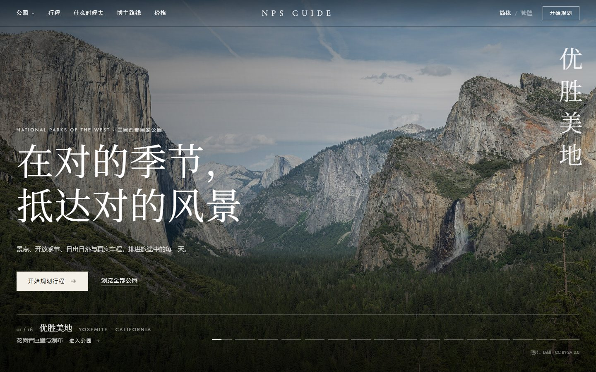
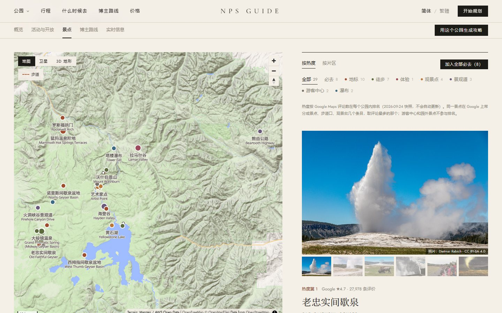
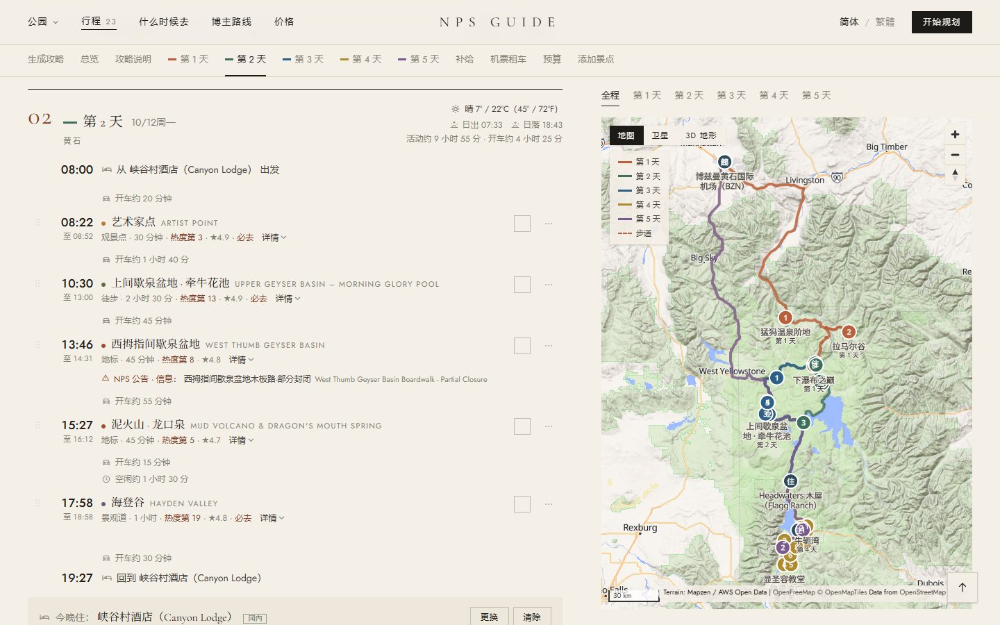
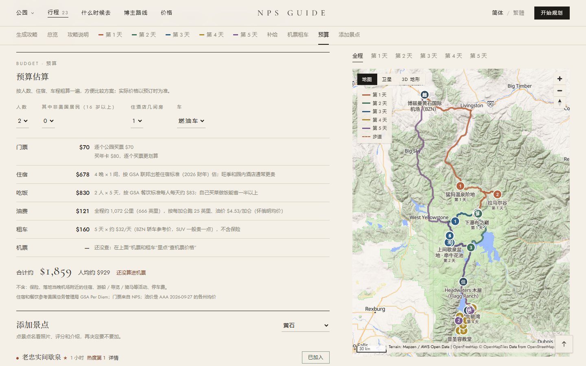
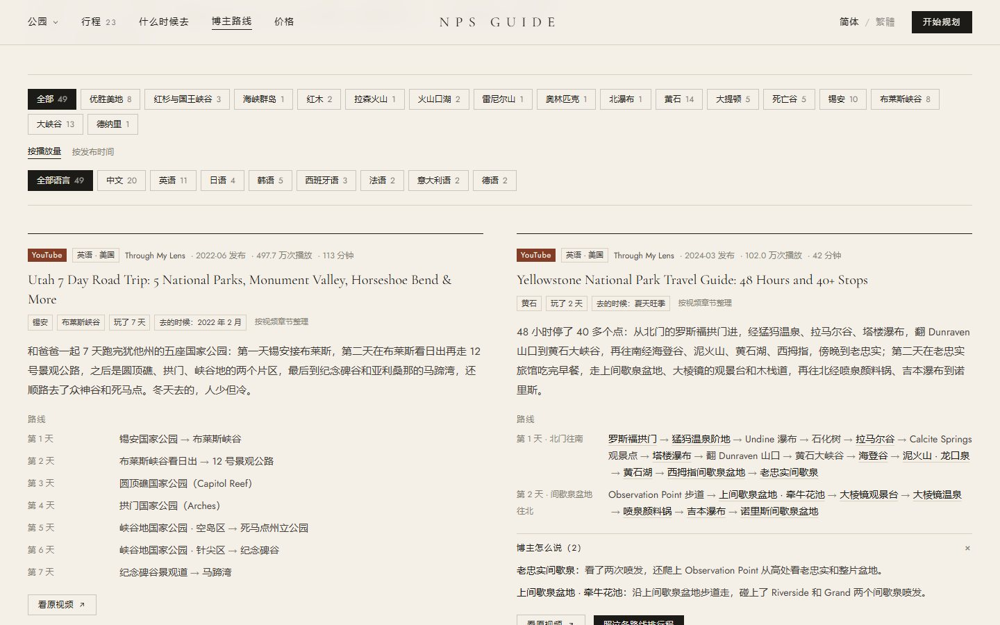
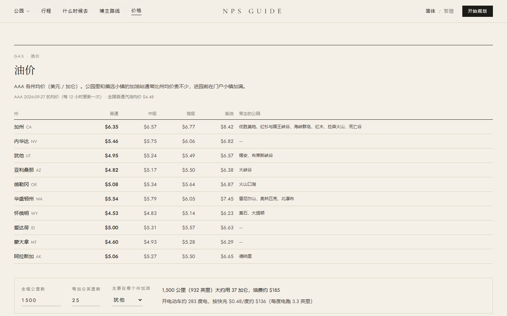

<div align="center">


# NPS Guide · 美国国家公园行程规划

**在对的季节，抵达对的风景。**

面向中文用户的美国国家公园旅行规划工具（也收了加拿大落基山和几处园外名胜）：按**日期**告诉你公园里什么开着、要不要预约、住哪、去哪加油充电、大概花多少钱，<br>还能一键生成每天几点到哪的攻略，出发后按实际进度重排。

A Chinese-language trip planner for U.S. national parks and the Canadian Rockies — date-aware openings, auto-generated day-by-day itineraries,<br>lodging, EV charging, budgets and creator routes. Works offline on your phone.

[功能](#功能) · [截图](#截图) · [覆盖的公园](#覆盖的公园) · [快速开始](#快速开始) · [数据来源](#数据来源) · [路线图](#路线图) · [开发文档](docs/DEVELOPMENT.md) · [English](#english)


<br>


</div>



> 非官方项目，与美国国家公园管理局（National Park Service）无关。开放情况、价格都会变，出发前以 [nps.gov](https://www.nps.gov) 为准。

## 为什么做这个

去美国国家公园自驾，最麻烦的不是“去哪”，而是**什么时候去、哪天能去哪**：山路冬天封、热门步道要抽签、园内酒店一年前就订满、电车在园里找不到快充、进了园子很难补给……中文信息散在各个平台，还常常过时。

NPS Guide 把这些按日期串起来：选好公园和日子，它告诉你那几天哪些景点开着、需要什么许可、日出日落几点，排好每天的路线和住处，算出开车时间和预算。

## 功能

- **景点地图**：24 座美国国家公园、加拿大落基山 3 座国家公园和 4 处园外名胜，共 487 个景点，地图和列表联动；196 条徒步路线按 OpenStreetMap 真实步道画出；每个景点最多 6 张照片、Google 评分和园内热度排名；普通地图、卫星图和 3D 地形随时切换。
- **一键生成攻略**：选公园（可以几座顺路的一起，比如盐湖城进出、先大提顿再黄石）、月份或日期、天数、从哪个机场或城市出发，自动挑景点、排出每天几点到哪、定好每晚住处（园内酒店、门户小镇或民宿区，附 Airbnb 链接）。
- **按日期提醒**：按当天日出日落安排日出 / 日落观景点；季节性关闭、许可证和预约写明原因和替代方案；16 天天气预报和 NWS 预警；NPS 实时公告附中文翻译，对到具体哪天哪个景点。
- **要提前订的**：按行程日期算出园内住宿、营地、许可证抽签（天使降临、半穹顶、The Wave……）、入园预约和船票各自哪天开订、还剩几天，错过了还有什么机会；可以一键加到手机日历，开放前提醒。
- **班车算进时间**：锡安峡谷、大峡谷 Hermit Road、马里波萨巨杉林、班夫梦莲湖、阿拉斯加的 Kennecott 这些私家车开不进去的路，时间按“开到换乘点 + 等车 + 坐车”算，赶不上末班车会提醒。
- **出发后也能改**：拖拽排序、换到别的天、标记完成或跳过，按实际进度重排剩下的行程；出发后打开是“今天”：下一站、按现在的时间几点能到、离日落还有多久、一键导航。
- **补给和预算**：每晚住处附近的超市、加油站、快充和亚洲超市，进园前的最后补给点；门票（含 2026 年非居民附加费、买年卡划不划算）、住宿、吃饭、油费、租车、机票，合计和人均。
- **什么时候去**：选一个出发日期，所有公园分成“最适合 / 可以去 / 不太合适”，每座写明原因（开放情况、往年同期的天气、特别活动）。
- **博主同款路线**：49 条中文、英语、日语、韩语和欧洲博主的 YouTube / B 站路线，按公园和语言筛选；博主对景点的评价显示在景点卡片上，一键照着排行程。
- **机票、租车、油价**：比较公园附近几个机场的机票，各机场租车参考价，公园所在各州的实时油价和油费计算。
- **手机和离线**：手机上一样好用；可以装到主屏（PWA），看过的页面、行程和地图在没信号的园区里也能打开；出发前可以按行程范围下载离线地图和照片；电脑上排好的行程用链接或二维码发到手机；行程可以打印或存成 PDF。
- **简体 / 繁體**：内容用简体撰写，繁体按台湾用语自动转换。

## 截图

截图里是用“自动生成攻略”现排的一个行程：黄石 + 大提顿 5 天，从博兹曼机场进出。

<table>
  <tr>
    <td width="50%" valign="top">
      
      <p><b>公园页</b>：景点地图、照片图集、Google 评分和热度排名，按类型和片区筛选</p>
    </td>
    <td width="50%" valign="top">
      
      <p><b>每天的行程</b>：几点到哪、停多久、开车多久，天气、日出日落和 NPS 公告；右边是按天着色的全程路线</p>
    </td>
  </tr>
  <tr>
    <td width="50%" valign="top">
      
      <p><b>自动生成的攻略</b>：每天去哪、住哪、开车多久，还有这几天要注意的（早起看日出、可能下雪封路）</p>
    </td>
    <td width="50%" valign="top">
      
      <p><b>预算</b>：门票逐个买还是买年卡、住宿和吃饭（GSA 标准）、按真实里程算的油费、租车和机票</p>
    </td>
  </tr>
  <tr>
    <td width="50%" valign="top">
      
      <p><b>什么时候去</b>：按出发日期给所有公园分类，写明为什么</p>
    </td>
    <td width="50%" valign="top">
      
      <p><b>博主同款路线</b>：多语言博主的路线、季节和对景点的评价，可以一键排进行程</p>
    </td>
  </tr>
  <tr>
    <td width="50%" valign="top">
      
      <p><b>机票、租车、油价</b>：各州实时油价、油费 / 电费计算，机票比较附近机场</p>
    </td>
    <td width="50%" valign="top">
      
      <p><b>手机上</b>：首页、每天的行程、景点列表；装到主屏后离线也能看</p>
    </td>
  </tr>
</table>

## 覆盖的公园

**美国国家公园**（24 座）

| 片区 | 公园 | 代码 | 2026 年非居民附加费 |
|---|---|---|---|
| 加州 · 内华达山脉 | 优胜美地 Yosemite | `yose` | $100 / 人 |
| 加州 · 内华达山脉 | 红杉与国王峡谷 Sequoia & Kings Canyon | `seki` | $100 / 人 |
| 南加州 | 海峡群岛 Channel Islands | `chis` | — |
| 南加州 | 约书亚树 Joshua Tree | `jotr` | — |
| 加州北部 · 俄勒冈 | 红木 Redwood | `redw` | — |
| 加州北部 · 俄勒冈 | 拉森火山 Lassen Volcanic | `lavo` | — |
| 加州北部 · 俄勒冈 | 火山口湖 Crater Lake | `crla` | — |
| 西雅图周边 | 雷尼尔山 Mount Rainier | `mora` | — |
| 西雅图周边 | 奥林匹克 Olympic | `olym` | — |
| 西雅图周边 | 北瀑布 North Cascades | `noca` | — |
| 落基山北部 | 黄石 Yellowstone | `yell` | $100 / 人 |
| 落基山北部 | 大提顿 Grand Teton | `grte` | $100 / 人 |
| 落基山北部 | 冰川 Glacier | `glac` | $100 / 人 |
| 科罗拉多 | 落基山 Rocky Mountain | `romo` | $100 / 人 |
| 拉斯维加斯周边 | 死亡谷 Death Valley | `deva` | — |
| 拉斯维加斯周边 | 锡安 Zion | `zion` | $100 / 人 |
| 拉斯维加斯周边 | 布莱斯峡谷 Bryce Canyon | `brca` | $100 / 人 |
| 拉斯维加斯周边 | 大峡谷 Grand Canyon | `grca` | $100 / 人 |
| 犹他东部 · 摩押 | 拱门 Arches | `arch` | — |
| 犹他东部 · 摩押 | 峡谷地 Canyonlands | `cany` | — |
| 犹他东部 · 摩押 | 圆顶礁 Capitol Reef | `care` | — |
| 阿拉斯加 | 德纳里 Denali | `dena` | — |
| 阿拉斯加 | 基奈峡湾 Kenai Fjords | `kefj` | — |
| 阿拉斯加 | 兰格尔–圣伊莱亚斯 Wrangell–St. Elias | `wrst` | — |

附加费从 2026 年起对 16 岁以上的非美国居民收取；同车有人持有效年卡（美国居民年卡、非居民年卡或这座公园的年卡）整车免收，网站的预算里已经算进去了。

**加拿大落基山**（3 座，Parks Canada 管理）：班夫 Banff `banf`、贾斯珀 Jasper `jasp`、幽鹤 Yoho `yoho`。门票按天收（加元），美国的年卡不能用；过美加边境要带护照，中国护照还要有效的加拿大签证。

**园外名胜**（4 处）：不是国家公园，网站上和国家公园分开列，写明归谁管、怎么进，国家公园年卡都不适用。

| 名胜 | 代码 | 管理方 | 怎么进 |
|---|---|---|---|
| 羚羊峡谷 Antelope Canyon | `ante` | 纳瓦霍部落公园 | 只能跟授权的向导团 |
| 马蹄湾 Horseshoe Bend | `hsbd` | 格伦峡谷国家休闲区，停车场归佩吉市 | 自己去，停车收费 |
| 纪念碑谷 Monument Valley | `mova` | 纳瓦霍部落公园 | 按人收门票，可以自驾观景路或跟团 |
| 波浪谷 The Wave | `wave` | 美国土地管理局（BLM） | 抽签拿许可证，每天限人数 |

## 快速开始

```bash
git clone https://github.com/momomojun/NPS-guide.git
cd NPS-guide
npm install
cp .env.example .env.local   # 可选：填 key，不填也能跑
npm run dev                  # 打开 http://localhost:3000
```

不配任何 key 也能用；配了会更稳、更全：

| 环境变量 | 做什么 | 怎么拿 |
|---|---|---|
| `DATA_GOV_API_KEY` | NPS 公告和门票、充电桩、住宿餐饮标准（不填用 `DEMO_KEY`，每小时 30 次） | [api.data.gov](https://api.data.gov/signup/)，免费 |
| `SERPAPI_API_KEY` | 更稳定的机票价格 | [serpapi.com](https://serpapi.com)，免费每月 250 次 |
| `DEEPL_API_KEY` | 质量更好的公告中文翻译 | [DeepL API Free](https://www.deepl.com/pro-api)，免费每月 50 万字符 |
| `SITE_PASSWORD` | 访问密码：设了之后打开网站要先输密码（部署到公网时用） | 自己定 |

构建版：`npm run build && npm run start`。代码结构、重新生成数据的脚本、截图脚本和整理数据时的注意事项见 [开发文档](docs/DEVELOPMENT.md)。

## 部署到手机上用

推荐 [Vercel](https://vercel.com)（Next.js 官方的托管，个人用免费）：用 GitHub 账号登录 Vercel → **Add New → Project** → 选这个仓库 → 在 **Environment Variables** 里填好下面几项 → **Deploy**。以后每次推送到 GitHub 都会自动重新部署。

- `SITE_PASSWORD`：访问密码。部署后的网址谁都能打开，设了密码就只有你和同行的人能看；输一次，这台设备一年内不用再输
- `DATA_GOV_API_KEY`：部署后基本必填。`DEMO_KEY` 按 IP 限次数，Vercel 的服务器是很多网站共用的，很快就会用完
- `SELF_USE_SCRAPE=1`（可选，设了密码再开）：部署后也实时查机票价格、油价

部署好后用手机打开网址：iPhone 在 Safari 里点 **分享 → 添加到主屏幕**，安卓在 Chrome 里点 **安装应用**。之后它就像一个 App，公园里没信号也能打开看过的页面和行程。

以后想做成微信小程序，要注意的事见 [开发文档](docs/DEVELOPMENT.md#以后做成微信小程序)。

## 技术栈

- [Next.js 16](https://nextjs.org)（App Router、Turbopack）、React 19、TypeScript、Tailwind CSS 4
- [MapLibre GL](https://maplibre.org) 地图：[OpenFreeMap](https://openfreemap.org) 底图、AWS 地形瓦片（阴影和 3D）、卫星图（美国用 USGS，加拿大用 EOX Sentinel-2），都不需要 key
- [OpenCC](https://github.com/nk2028/opencc-js) 简繁转换；PWA 离线（service worker）
- 没有数据库：景点、车程、步道、补给点、往年天气等由 `scripts/` 里的脚本从开放数据预先生成，行程存在浏览器 localStorage 里

## 数据来源

大多是公开、免费的数据，完整列表和整理方法见 [开发文档](docs/DEVELOPMENT.md#数据源)：

- **公园、公告、门票**：[NPS API](https://www.nps.gov/subjects/developer/api-documentation.htm)；加拿大的公园和园外名胜按 Parks Canada、纳瓦霍部落公园、BLM 等官方页面整理；**充电桩**：NLR Alternative Fuel Stations
- **天气**：[Open-Meteo](https://open-meteo.com)（16 天预报、往年同期）、[NWS](https://www.weather.gov/documentation/services-web-api)（预警）
- **地图、车程、步道、补给点**：[OpenStreetMap](https://www.openstreetmap.org)（Overpass、OSRM、Valhalla、Photon）
- **照片**：[Wikimedia Commons](https://commons.wikimedia.org)，按授权逐张署名
- **住宿和餐饮标准**：GSA Per Diem；**油价**：AAA；**租车**：Kayak 参考价；**机票**：Google Flights / SerpApi
- **热度和评分**：Google Maps 评分和评论数（手动快照，只在自用阶段使用）
- **博主路线**：YouTube / B 站公开视频的简介、章节和文稿，转述并附原视频链接

## 路线图

已经能用：景点地图和图集、自动生成攻略、按日期的开放和许可提醒、要提前订的（开订日期和日历提醒）、班车算进时间、每晚住宿、拖拽调整和按进度重排、“今天”模式、天气和 NPS 公告、补给、预算、机票租车油价、什么时候去、博主路线、发到手机、离线地图和打印。

接下来：

- [ ] 按日期的道路和设施开放：历年开关日期 + NPS 实时公告
- [ ] 充电桩打卡：能用 / 坏了 / 找不到，给桩打可靠度分
- [ ] 亚洲超市补漏：OpenStreetMap 里漏得多，用 Google Places 补 + 人工校对
- [ ] 按实际打卡学习个人配速，自动调整后面的时间

完整的路线图和待办见 [开发文档](docs/DEVELOPMENT.md#路线图)。

## English

**NPS Guide** is an unofficial, Chinese-language (Simplified & Traditional) trip planner for 24 U.S. national parks in the West: Yosemite, Sequoia & Kings Canyon, Channel Islands, Joshua Tree, Redwood, Lassen Volcanic, Crater Lake, Mount Rainier, Olympic, North Cascades, Yellowstone, Grand Teton, Glacier, Rocky Mountain, Death Valley, Zion, Bryce Canyon, Grand Canyon, Arches, Canyonlands, Capitol Reef, Denali, Kenai Fjords and Wrangell–St. Elias. It also covers Banff, Jasper and Yoho in the Canadian Rockies, and four famous non-park sites listed separately: Antelope Canyon, Horseshoe Bend, Monument Valley and The Wave.

- **Attraction maps**: 487 curated sights, 196 hiking trails traced on real OpenStreetMap paths, photo galleries, satellite and 3D terrain views.
- **Auto-generated itineraries**: pick parks, dates and an arrival airport, and get a day-by-day plan with times, drive durations, sunrise and sunset stops, and nightly lodging.
- **Date-aware alerts**: seasonal closures, permits and reservations, a 16-day forecast, NWS warnings, and live NPS alerts translated into Chinese.
- **Booking timeline**: when each lodge, campground, permit lottery, timed entry or boat ticket on your trip opens for booking, with calendar (.ics) reminders; mandatory shuttles (Zion, Grand Canyon, Mariposa Grove, Moraine Lake, Kennecott) are built into the timings.
- **On the road**: a “today” view with the next stop and live arrival times, trip sharing to your phone by link or QR code, and offline map downloads.
- **Budget and logistics**: park fees (including the 2026 nonresident surcharge), lodging and meals, fuel or EV charging, car rental, flights, and supplies near each night's stay.
- **Creator routes**: 49 routes from Chinese, English, Japanese, Korean and European YouTube and Bilibili creators.
- **Offline**: a PWA that keeps your trip and viewed maps available without cell signal.

Built with Next.js 16, React 19, TypeScript, Tailwind CSS 4 and MapLibre GL, mostly on open data (NPS API, OpenStreetMap, Open-Meteo, Wikimedia Commons). No keys are required to run it locally: `npm install && npm run dev`.

## 声明

- 非官方项目，与美国国家公园管理局（National Park Service）无关，名字里的 NPS 只是说明用途。
- 景点的开放情况、活动日期和价格是整理时的快照，会过时；出发前请以官网和预订页面为准。
- 照片来自 Wikimedia Commons，作者和授权在网站上逐张标注（截图里也能看到）；地图数据 © OpenStreetMap contributors。
- 博主路线是我们的转述，版权归原作者，想看完整内容请点原视频。
